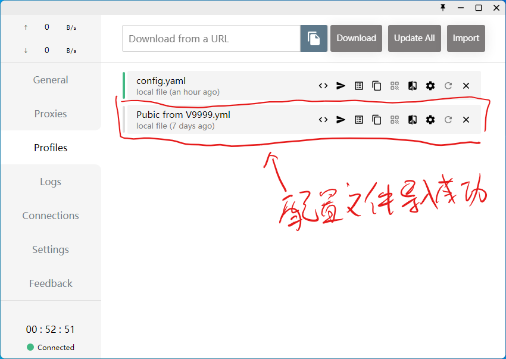

# [Profile for Clash](https://github.com/Shuery-Shuai/Profiles_for_Clash "Shuery-Shuai/Profiles_for_Clash: Profiles can be used in Clash for Windows, Clash for Android and so on.")

一些可用于 Clash for Windows、Clash for Android 等应用的配置文件。

## 导入方法

### [Clash for Windows](https://github.com/Fndroid/clash_for_windows_pkg "Fndroid/clash_for_windows_pkg: A Windows/macOS GUI based on Clash.") 本地导入

#### 拖拽导入

1. 直接将配置文件（无需解压）拖入 [Clash for Windows](https://github.com/Fndroid/clash_for_windows_pkg "Fndroid/clash_for_windows_pkg: A Windows/macOS GUI based on Clash.") **Profiles** 页面。
   

#### 通过 Import 按钮导入

1. 解压 **Profiles** 文件夹
   
2. 点击 **Import** 按钮
   
3. 定位 **Profiles** 文件夹
   
4. 选中配置文件并打开
   
   > **注意**：本操作**不支持多选**，如有多个文件需**重复 2-4 步**。
5. 导入成功
   

### [Clash for Windows](https://github.com/Fndroid/clash_for_windows_pkg "Fndroid/clash_for_windows_pkg: A Windows/macOS GUI based on Clash.") 网络导入

1. 复制配置链接
   
   > **提示**：本项目[配置文件链接](#配置文件链接 "点击前往“配置文件链接”")。
2. 粘贴配置链接并点击 **Download** 按钮下载
   
3. 导入成功
   
   > **注意**：网络导入成功后会**自动**将配置切换至**刚刚导入的配置**。

> **注意**：通过网络导入**本项目的配置文件**需能够访问 <https://raw.githubusercontent.com>。

## 配置文件及其来源

“Public from V9999”来自 [Alvin9999](https://github.com/Alvin9999 "Github@Alvin9999 (自由上网)") 在项目 [new-pac](https://github.com/Alvin9999/new-pac "Alvin9999/new-pac: 科学上网/自由上网/翻墙/软件/方法，一键翻墙浏览器，免费shadowsocks/ss/ssr/v2ray/goflyway账号/节点分享，vps一键搭建脚本/教程。") 中的分享。

“Public from FQD”来自 [翻墙党](https://fanqiangdang.com "翻墙论坛 | 翻墙党社区 -  Powered by Discuz!") 在群组 [SS 节点公益发放](https://t.me/ssList "Telegram@ssList")、[SSR 节点免费发放](https://t.me/ssrList "Telegram@ssrList")、[V2ray,Vmess 节点免费发放](https://t.me/V2List "Telegram@V2List")中的分享。

> **提示**：本项目所有配置均通过 [tiny2013](https://github.com/tindy2013 "Github@tindy2013 (Tindy X)") 开发的 [subconverter](https://github.com/tindy2013/subconverter "tindy2013/subconverter: Utility to convert between various subscription format.") 自动生成。
> **警告**：本项目配置均来自网络，使用时请遵守当地法律法规。若有侵权，请提出，会尽快删除。

## 建议添加规则

```yaml
- DOMAIN,tencentcs.com,DIRECT # 腾讯云
```

## 配置文件链接

- [Public from V9999](https://raw.githubusercontent.com/Shuery-Shuai/Profiles_for_Clash/main/Profiles/Pubic%20from%20V9999.yml "链接（“右击”后选择“复制链接”）")
- [Public from FQD](https://raw.githubusercontent.com/Shuery-Shuai/Profiles_for_Clash/main/Profiles/Pubilc%20from%20FQD.yml "链接（“右击”后选择“复制链接”）")

## 文档更新日志

- 2021/03/06 09:25:31
  1. 创建文件
- 2021/03/21 10:58:32
  1. 新增“Public from FQD”介绍
- 2021/04/20 20:38:13
  1. 添加网络导入 URL
- 2021/04/20 21:13:35
  1. 修改导入方法
  2. 添加配置文件生成工具来源
  3. 更新配置文件 URL
- 2021/07/25 11:53:08
  1. 改善文档排版
  2. 增加 Clash for Windows 导入方法
  3. 删除 Clash for Android 导入方法（不详细）
